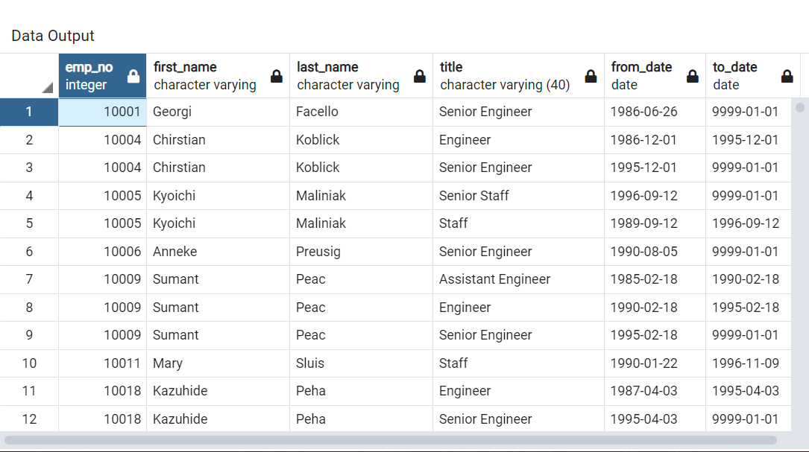
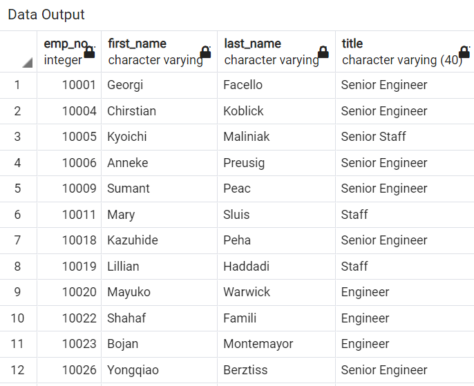
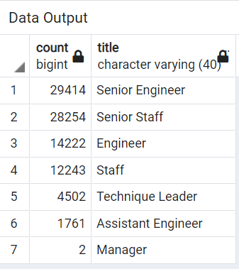
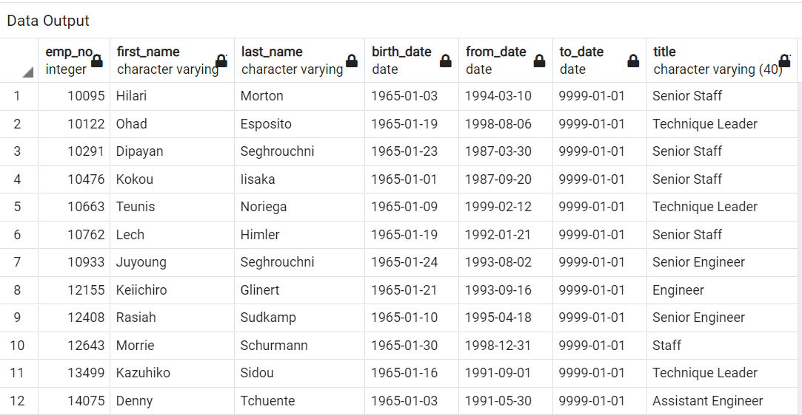
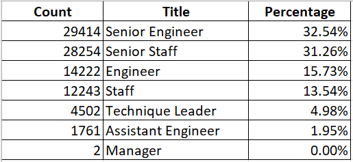

# Pewlett Hackard Analysis

##Overview
Pewlett Hackard is a large company with several thousand employees and it's been around for a long time. Its baby boomers have begun to retire at a rapid rate. Pewlett Hackard is looking towards the future in two ways:

1. It is offering retirement packages for employees meeting certain criteria.
2. It is starting to think about which positions will need to be filled in the near future.

Bobby, an up and coming HR analyst, is looking to get the following by using SQL and Postgres:
1. The number of employees retiring by title.
2. Employees eligible for the mentorship program who can mentor the next generation of Pewlett Hackard employees

## Results

Following are four key highlights from the analysis performed.

- By generating the list of current employees who were born between January 1, 1952 and December 31, 1955, we see 133,776 entries. As expected this shows many employees holding more than one title during their tenure at Pewlett Hackard Enterprise. The retirement_titles.csv file captures this data. See below an example showing an employee holding more than one title.

 
- By doing another iteration of query to eliminate multiple entries for the same employee, we are able to get a list of retirement eligible employees with the most recent job title. This is captured in "unique_titles.csv". See snapshot below showing the same. We see that the list comes down to 90,398 entries.

- We see 7 distinct titles among the employee population who is eligible for retirement as captured in retiring_titles.csv table. The figure below shows the breakdown of the titles. 

- Of the retirement elibible emplyees, 1,549 are eligible to participate in a mentorship program, as captured in mentorship_eligibility.csv. See snapshot below.

## Summary

### How many roles will need to be filled as the "silver tsunami" begins to make an impact?

We need to fill 7 roles as the "silver tsunami" begins to make an impact (breakdown illustrated below). We can see that Senior Engineer and Senior Staff categories dominate this list; with 32.53% and 31.25% respectively. Engineer and Staff were the next two highest percentages, 15.73% and 13.54% respectively.

### Are there enough qualified, retirement-ready employees in the departments to mentor the next generation of Pewlett Hackard employees?

Only 1,549 employees are available for mentorship. This is a relatively small number compared to the number of employees which are going to have to come in to replace the employees who are retiring. An interesting exercise would be to see how different departments are placed in terms of the ratio of mentors to number of retiring employees.